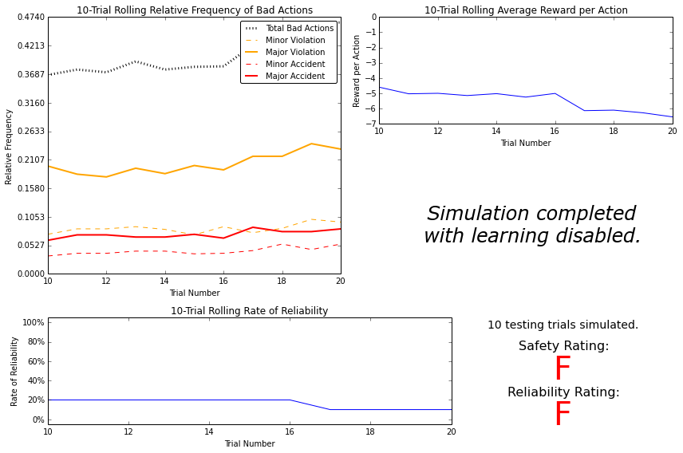
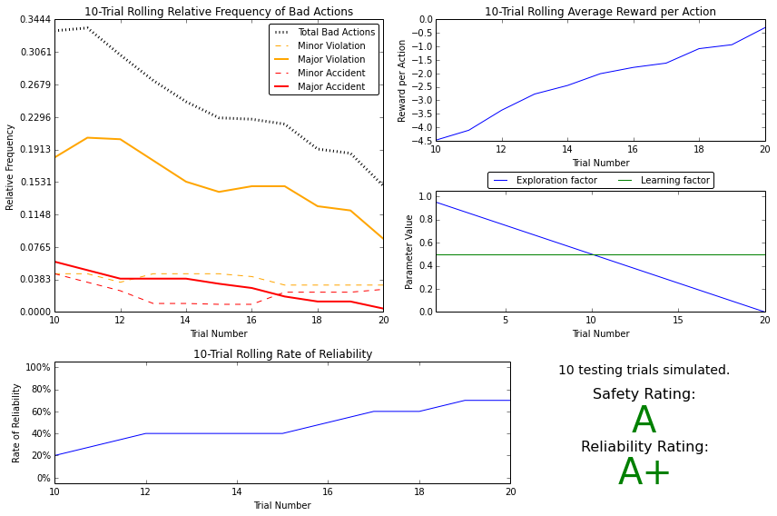
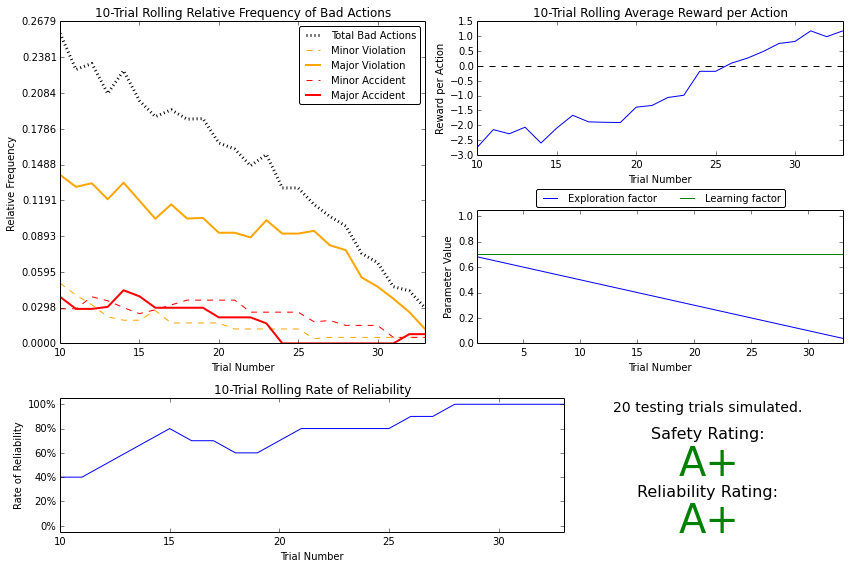

# Forked from [Udacity Nanodegree](https://github.com/udacity/machine-learning)
# Reinforcement Learning
## Project: Train a Smartcab How to Drive

### Install

This project requires **Python 2.7** with the [pygame](https://www.pygame.org/wiki/GettingStarted
) library installed

### Code

Template code is provided in the `smartcab/agent.py` python file. Additional supporting python code can be found in `smartcab/enviroment.py`, `smartcab/planner.py`, and `smartcab/simulator.py`. Supporting images for the graphical user interface can be found in the `images` folder.

### Run

```python smartcab/agent.py```  
```python -m smartcab.agent```

### Results

#### Evaluation metrics

An optimized Q-Learning driving agent that will navigate a *Smartcab* through its environment towards a goal. Since the *Smartcab* is expected to drive passengers from one location to another, the driving agent will be evaluated on two very important metrics: **Safety** and **Reliability**. A driving agent that gets the *Smartcab* to its destination while running red lights or narrowly avoiding accidents would be considered **unsafe**. Similarly, a driving agent that frequently fails to reach the destination in time would be considered **unreliable**. Maximizing the driving agent's **safety** and **reliability** would ensure that *Smartcabs* have a permanent place in the transportation industry.

**Safety** and **Reliability** are measured using a letter-grade system as follows:

| Grade 	| Safety 	| Reliability 	|
|:-----:	|:------:	|:-----------:	|
|   A+  	|  Agent commits no traffic violations,<br/>and always chooses the correct action. | Agent reaches the destination in time<br />for 100% of trips. |
|   A   	|  Agent commits few minor traffic violations,<br/>such as failing to move on a green light. | Agent reaches the destination on time<br />for at least 90% of trips. |
|   B   	| Agent commits frequent minor traffic violations,<br/>such as failing to move on a green light. | Agent reaches the destination on time<br />for at least 80% of trips. |
|   C   	|  Agent commits at least one major traffic violation,<br/> such as driving through a red light. | Agent reaches the destination on time<br />for at least 70% of trips. |
|   D   	| Agent causes at least one minor accident,<br/> such as turning left on green with oncoming traffic.       	| Agent reaches the destination on time<br />for at least 60% of trips. |
|   F   	|  Agent causes at least one major accident,<br />such as driving through a red light with cross-traffic.      	| Agent fails to reach the destination on time<br />for at least 60% of trips. |

A visualization framework has also been imported to analyze the results.

#### With no Learning


#### With Q-Learning


#### Improved Q-Learning


#### Logs

* The logs for training without learning can be found at [logs/sim_no-learning.csv](logs/sim_no-learning.csv)

* The logs for training with Q-learning can be found at [logs/sim_default-learning.csv](logs/sim_default-learning.csv)

* The logs for training with improved Q-learning can be found at [logs/sim_improved-learning.csv](logs/sim_improved-learning.csv)